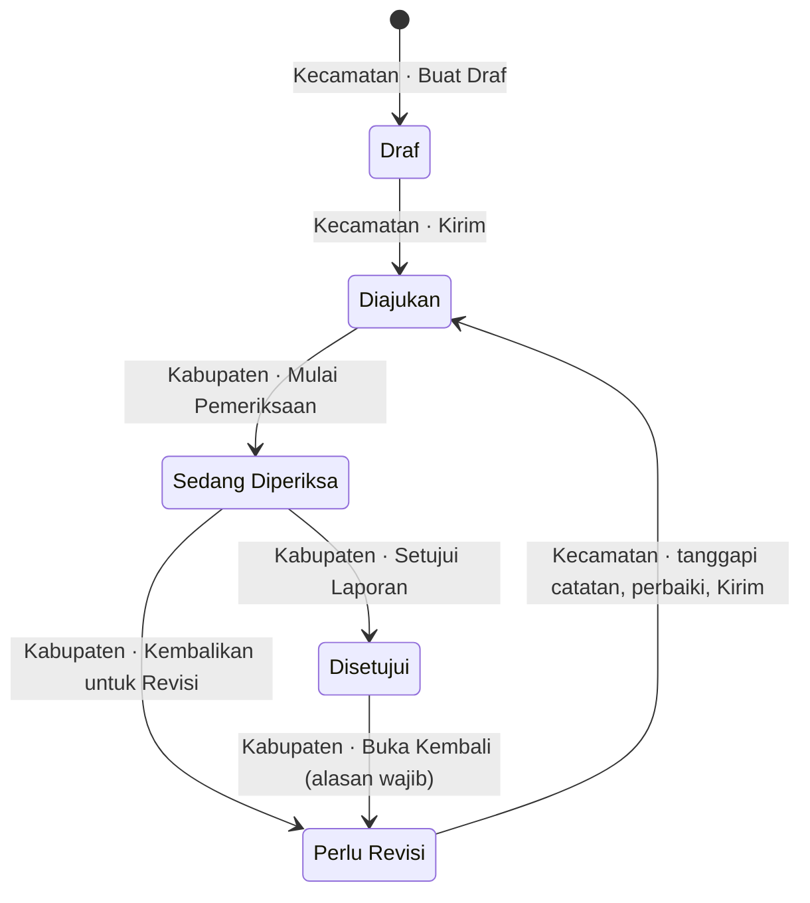

# Panduan Alur SIAP LAPOR

Panduan ini menjelaskan cara menyusun, mengirim, memeriksa, merevisi, dan
menyetujui Laporan Hasil Pengawasan (LHP) Formulir Model A di SIAP LAPOR.

## Dua peran

| Peran | Siapa | Yang dikerjakan |
| --- | --- | --- |
| **Admin Kecamatan** (operator) | Satu akun per kecamatan | Membuat dan mengisi LHP, mengirim, menanggapi catatan revisi, memperbaiki, mengirim ulang |
| **Admin Kabupaten** | Pemeriksa di tingkat kabupaten | Membuka periode, mengelola akun dan kecamatan, memeriksa, memberi catatan, mengembalikan, menyetujui, membuka kembali |

Admin Kecamatan hanya melihat laporan kecamatannya sendiri. Admin Kabupaten
tidak dapat mengubah isi laporan, hanya memberi catatan dan keputusan.

Tombol hanya muncul untuk peran dan status yang tepat. Bila tombol yang dicari
tidak ada, periksa dulu **akun siapa yang sedang masuk** (pojok kanan atas) dan
**status laporan** (lencana di samping judul).

## Gambaran alur

| Status | Artinya | Giliran siapa |
| --- | --- | --- |
| **Draf** | Laporan sedang diisi, belum pernah dikirim | Kecamatan |
| **Diajukan** | Sudah dikirim, menunggu diperiksa | Kabupaten |
| **Sedang Diperiksa** | Ada pemeriksa aktif | Kabupaten (pemeriksa aktif) |
| **Perlu Revisi** | Dikembalikan dengan catatan | Kecamatan |
| **Disetujui** | Selesai | — |

## Persiapan (Admin Kabupaten, sekali di awal)

1. **Data Kecamatan**: pastikan kecamatan sudah terdaftar.
2. **Akun Kecamatan → Tambah Akun**: buat akun operator, pilih kecamatannya,
   beri kata sandi sementara. Operator menggantinya di **Profil Saya**.
3. **Periode Pelaporan → Tambah Periode**: buka periode yang aktif. Laporan baru
   hanya dapat dibuat pada periode aktif.

## Langkah 1 — Kecamatan membuat dan mengirim laporan

1. **Laporan (LHP) → Buat LHP**, pilih periode, klik **Buat Draf**.
2. Isi empat tahap formulir: **Data Pengawas → Kegiatan → Hasil → Pengesahan &
   Lampiran**. Pindah tahap lewat tombol tahap di atas formulir.
3. Klik **Simpan Draf** secara berkala. Draf boleh belum lengkap.
4. Opsional: klik **Pratinjau** untuk melihat tampilan Formulir Model A.
5. Klik **Kirim → Ya, kirim sekarang**.

Catatan:

- Tombol **Kirim** tidak aktif selama ada perubahan yang belum disimpan.
  Simpan draf dulu.
- Semua field wajib harus terisi. Yang boleh kosong hanya tanggal selesai, jam
  mulai, dan jam selesai. Bila ada yang kurang, pesan muncul di field tersebut.
- Setelah dikirim, isi dan lampiran versi itu **terkunci permanen**. Perubahan
  hanya bisa dilakukan bila Kabupaten mengembalikan laporan.
- Lampiran: PDF, JPG, atau PNG, maksimal 10 MB per berkas dan 10 berkas per
  versi (bawaan; dapat diubah administrator).

## Langkah 2 — Kabupaten memeriksa

1. Buka notifikasi "Laporan baru diajukan", atau **Laporan (LHP)** lalu pilih
   laporan berstatus **Diajukan**.
2. Gulir ke kartu **Pemeriksaan dan Catatan Revisi**, klik **Mulai Pemeriksaan**.
   Anda menjadi **pemeriksa aktif** dan status berubah menjadi Sedang Diperiksa.
3. Baca isi Formulir Model A dan lampiran pada halaman yang sama.

Satu laporan hanya punya satu pemeriksa aktif. Admin Kabupaten lain tetap dapat
melihat, tetapi harus klik **Ambil Alih Pemeriksaan** dan mengisi alasan sebelum
dapat memutuskan.

Susunan kartu Pemeriksaan dari atas ke bawah:

1. Baris "Pemeriksa aktif"
2. **Tombol keputusan**: Kembalikan untuk Revisi, Setujui Laporan
3. Form **Tambah Catatan**
4. Daftar catatan, masing-masing dengan tombol **Tandai Selesai**
5. Riwayat Siklus Pemeriksaan

## Langkah 3a — Kabupaten mengembalikan untuk revisi

1. Pada form **Tambah Catatan**, pilih "Kaitkan dengan":
   catatan umum, field tertentu (misalnya *Uraian singkat hasil pengawasan*),
   atau lampiran tertentu. Tulis isi catatan, klik **Tambah Catatan**.
   Ulangi untuk setiap hal yang perlu diperbaiki.
2. Klik **Kembalikan untuk Revisi**. Catatan umum di dialog boleh dikosongkan.
   Klik **Kembalikan**.
3. Status menjadi **Perlu Revisi** dan kecamatan menerima notifikasi.

Pengembalian ditolak bila tidak ada catatan terbuka. **Jangan** klik Tandai
Selesai pada catatan yang ingin dikembalikan ke kecamatan.

## Langkah 3b — Kecamatan menanggapi dan mengirim ulang

1. Buka notifikasi "Laporan dikembalikan untuk revisi", atau buka laporan
   berstatus **Perlu Revisi**.
2. Pada kartu **Pemeriksaan dan Catatan Revisi**, di bawah setiap catatan
   terbuka ada kotak **Tulis tanggapan**. Jelaskan perbaikannya, klik
   **Kirim Tanggapan**. Lakukan untuk **semua** catatan terbuka.
3. Klik **Ubah Laporan** di atas halaman, perbaiki isian atau lampiran, klik
   **Simpan Draf**.
4. Klik **Kirim → Ya, kirim sekarang**. Status kembali menjadi **Diajukan**.

Catatan:

- Pengiriman ulang ditolak bila masih ada catatan tanpa tanggapan.
- Tanggapan tidak dapat diubah atau dihapus setelah dikirim.
- Tanggapan **tidak** menutup catatan. Yang menandai selesai adalah Kabupaten.
- Versi yang dulu diperiksa tetap tersimpan utuh; perbaikan masuk ke versi baru.

## Langkah 4 — Kabupaten memeriksa ulang dan menyetujui

1. Buka laporan yang diajukan ulang, klik **Mulai Pemeriksaan** lagi.
2. Opsional: **Riwayat Versi → Lihat** pada versi terbaru, lalu pilih
   **Bandingkan dengan versi** sebelumnya untuk melihat apa yang berubah.
3. Baca tanggapan di bawah tiap catatan. Bila sudah sesuai, klik
   **Tandai Selesai**. Bila belum, tambah catatan baru lalu kembalikan lagi
   (kembali ke Langkah 3a).
4. Setelah semua catatan selesai, klik **Setujui Laporan → Setujui**.
5. Status menjadi **Disetujui** dan kecamatan menerima notifikasi.

Persetujuan ditolak bila masih ada catatan terbuka dari siklus mana pun,
termasuk siklus sebelumnya.

## Langkah 5 (bila perlu) — Membuka kembali laporan yang disetujui

Admin Kabupaten klik **Buka Kembali** dan mengisi alasan (wajib).

- Keputusan persetujuan lama tetap tercatat pada riwayat.
- Laporan keluar dari hitungan "disetujui" dan berstatus **Perlu Revisi**.
- Alasan menjadi catatan terbuka yang harus ditanggapi kecamatan, lalu alur
  berlanjut dari Langkah 3b.

## Cetak PDF

Pada kartu **Riwayat Versi**, klik **PDF** di samping versi yang diinginkan,
atau **Unduh PDF** di atas halaman detail.

- PDF selalu dicetak dari isi versi tersebut, bukan dari draf terbaru.
- Versi yang belum disetujui diberi tanda **BELUM TERVERIFIKASI**.
- Versi yang pernah disetujui tetapi sudah digantikan diberi tanda
  **VERSI HISTORIS**.
- Persetujuan di aplikasi bukan tanda tangan elektronik. PDF menyediakan ruang
  tanda tangan untuk ditandatangani manual.

## Notifikasi

Ikon lonceng di kanan atas menunjukkan jumlah notifikasi belum dibaca.

| Peristiwa | Penerima |
| --- | --- |
| Laporan diajukan / diajukan ulang | Semua Admin Kabupaten aktif |
| Dikembalikan untuk revisi | Akun kecamatan pemilik laporan |
| Disetujui | Akun kecamatan pemilik laporan |
| Dibuka kembali | Akun kecamatan pemilik laporan |

Tidak ada notifikasi email atau WhatsApp.

## Tombol tidak muncul?

| Tombol yang dicari | Syarat agar muncul |
| --- | --- |
| **Ubah Laporan**, **Kirim** | Masuk sebagai Admin Kecamatan pemilik laporan; status Draf atau Perlu Revisi |
| **Kirim** tidak aktif | Masih ada perubahan belum disimpan — klik Simpan Draf |
| **Tulis tanggapan** | Admin Kecamatan; status Perlu Revisi; catatan masih Terbuka |
| **Mulai Pemeriksaan** | Admin Kabupaten; status Diajukan |
| **Tambah Catatan**, **Tandai Selesai**, **Kembalikan untuk Revisi**, **Setujui Laporan** | Admin Kabupaten; status **Sedang Diperiksa**; Anda **pemeriksa aktif** |
| **Ambil Alih Pemeriksaan** | Admin Kabupaten; laporan sedang diperiksa oleh Admin Kabupaten lain |
| **Buka Kembali** (laporan) | Admin Kabupaten; status Disetujui |

Kesalahan yang sering terjadi:

- **Masuk dengan akun yang salah.** Operator kecamatan tidak pernah melihat
  tombol Setujui atau Tandai Selesai. Untuk mencoba dua peran sekaligus, buka
  akun kedua di jendela samaran (incognito) atau browser lain.
- **Lupa klik Mulai Pemeriksaan setelah laporan diajukan ulang.** Setiap
  pengiriman ulang memulai siklus pemeriksaan baru.
- **Pesan "Laporan sudah diubah pengguna lain. Muat ulang halaman…"** atau
  pesan lain berisi "Muat ulang halaman". Orang lain (atau tab lain) mengubah
  laporan sejak halaman dibuka. Muat ulang halaman lalu ulangi.
  Isian yang belum disimpan pada tab lama tidak menimpa perubahan orang lain.
